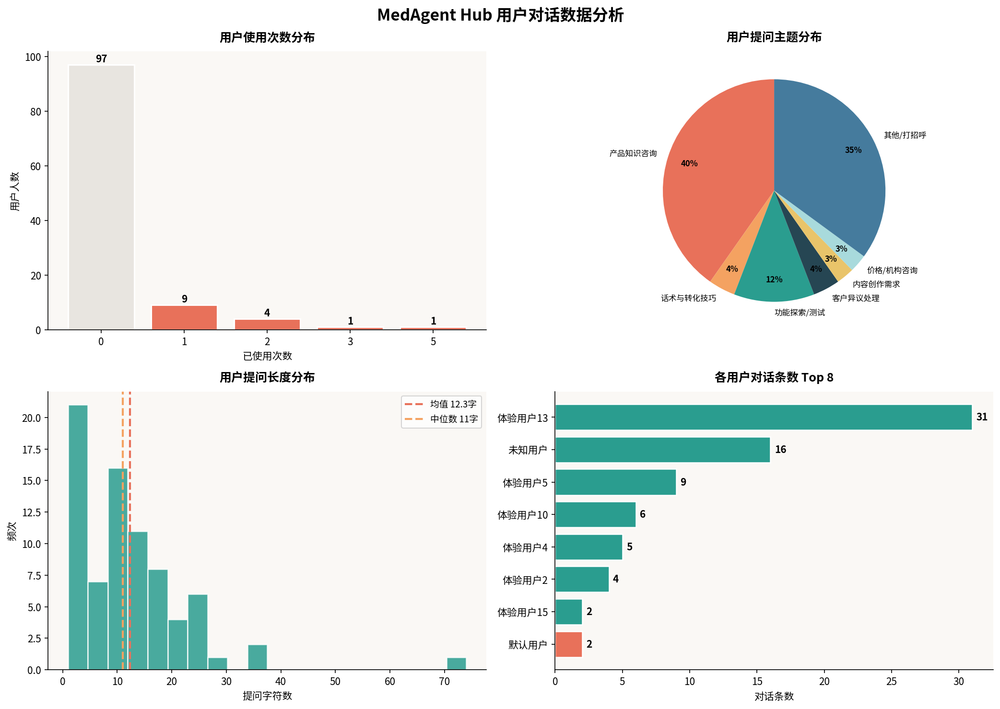
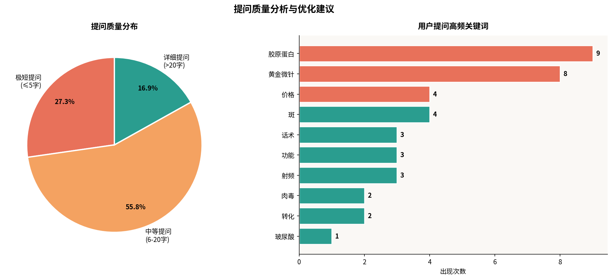

## MedAgent Hub 用户对话数据分析报告

**报告日期**: 2026年02月28日

---

### 1. 核心洞察 (Executive Summary)

本次分析基于过去24小时内的 **112 名用户**和 **77 条对话记录**。核心发现如下：

- **用户活跃度低，转化漏斗存在巨大优化空间**：注册用户中仅有 **13.4%** 产生了至少一次对话，高达 **86.6%** 的用户在注册后便流失，这表明从“注册”到“首次使用”的引导流程亟待加强。
- **提问质量参差不齐，用户不知道“如何问”**：**超过 83%** 的提问是**少于20字的短问题**，其中更有 **27%** 是“你好”之类的无效寒暄。这严重限制了 Agent 发挥其深度分析和内容生成的能力。
- **“产品知识”是绝对刚需**：在所有有效提问中，**40%** 集中在对“胶原蛋白”、“黄金微针”等具体产品和技术的咨询上，这证明了 Agent 在专业知识问答上的核心价值。
- **“超级用户”已出现，但未被充分激活**：一位“体验用户13”贡献了 **40%** 的对话量，其提问质量远高于平均水平，但其使用上限仅为10次，很快就会耗尽。这提示我们需要一套针对高价值用户的激励和转化机制。
- **后台数据缺失**：对话记录中 `Agent` 列全为空值，无法区分是哪个 Agent 产生的回复，这对于评估各 Agent 的表现和进行针对性优化是**致命的**。

### 2. 数据概览

| 指标 | 数值 |
|:---|:---|
| 注册用户总数 | 112 人 |
| 活跃用户数（至少使用1次） | 15 人 |
| **活跃率** | **13.4%** |
| 总对话条数 | 77 条 |
| 平均提问长度 | 12.3 字符 |
| 平均回复长度 | 831.9 字符 |

### 3. 用户行为分析

#### 3.1. 活跃度分析：冰山下的沉默大多数

在112名注册用户中，高达 **97 人（86.6%）** 的使用次数为0。这揭示了一个严峻的现实：绝大多数用户在完成注册后，并没有迈出“与 Agent 对话”这关键的第一步。这可能是由于：
- **引导缺失**：用户注册后不知道下一步该做什么。
- **价值感知不足**：用户不清楚与 Agent 对话能为他们带来什么具体价值。
- **界面/交互障碍**：可能存在某些技术或设计上的问题阻碍了用户发起对话。

#### 3.2. 提问质量分析：用户需要“被引导”

- **极短提问（≤5字）占比 27.3%**：大量“你好”、“在吗”之类的对话开启方式，不仅浪费了用户的交互次数，也无法触发 Agent 的深度能力。
- **详细提问（>20字）仅占 16.9%**：只有少数用户能够提出包含足够上下文和明确意图的高质量问题，例如“帮我仔细分析重组胶原蛋白和动物源性胶原蛋白之间的区别，各品牌之间如何对比”。

这充分证明了我们近期为 Agent 增加“**引导性问题**”功能的正确性。用户需要被启发和教育，让他们了解“可以问什么”以及“如何问得更好”。

#### 3.3. 提问主题分析：“产品知识”是核心场景

在所有提问中，“**产品知识咨询**”以 **40%** 的占比遥遥领先，成为最核心的用户需求。用户高度关注不同产品（如胶原蛋白、玻尿酸、肉毒素）之间的区别、技术原理、优势劣势等。这表明 MedAgent Hub 的核心竞争力在于其**专业、深度、结构化的医疗美容知识库**。

其次，“**功能探索/测试**”（12%）和“**话术与转化技巧**”（4%）也占据了一定比例，说明用户对 Agent 的能力边界和应用场景有探索意愿。

### 4. Agent 优化建议

基于以上分析，提出以下三条核心优化建议：

#### **建议一：强化新用户引导（Onboarding），提升活跃率**

**目标**：将新用户首次对话转化率从 13.4% 提升至 30% 以上。

- **优化欢迎语**：新用户首次进入对话界面时，由 Agent 主动发起一段精心设计的欢迎语，清晰地告知用户“我是谁”、“我能做什么”，并直接给出 3-5 个高质量的提问范例，用户点击即可发送。
- **增加“猜你想问”**：在对话输入框上方，永久显示几个根据当前 Agent 角色动态生成的高频问题按钮，降低用户的提问门槛。
- **引入新手任务**：设计一个简单的“新手任务”，如“完成一次超过3轮的深度问答”，完成后给予少量额外使用次数奖励，激励用户探索。

#### **建议二：深化“引导性问题”，提升对话质量**

**目标**：将详细提问（>20字）的比例从 16.9% 提升至 30% 以上。

- **优化现有引导性问题**：当前的引导性问题是普适性的。下一步应根据每个 Agent 的角色和用户的提问内容，动态生成**更具上下文关联性**的引导问题。例如，当用户问完“胶原蛋白和玻尿酸的区别”后，引导问题可以是“您想了解哪种产品更适合解决您面部的具体问题（如法令纹、泪沟）？”
- **引入“追问”机制**：当 Agent 识别到用户的提问过于宽泛或模糊时（如“黄金微针怎么样？”），在正式回答前，可以先进行一轮“澄清式追问”，如“您是想了解它的治疗原理、价格、还是术后注意事项呢？明确您最关心的一点，我可以给出更精准的回答。”

#### **建议三：建立用户分层与激励体系，激活高价值用户**

**目标**：识别并留住“超级用户”，探索付费转化路径。

- **识别“超级用户”**：建立用户健康度模型，将“对话次数 > 5次/周”、“平均提问长度 > 30字”的用户标记为“超级用户”。
- **差异化服务**：对于“超级用户”，可以考虑：
    - **自动增加使用上限**：当其使用次数接近上限时，自动为其增加额度，并通过邮件或界面提示告知。
    - **优先体验新功能**：未来上线新 Agent 或新功能时，邀请他们优先内测。
    - **定向推送 Pro 版优惠**：在他们体验到深度价值后，适时推送专业版 Pro 的订阅优惠，转化路径更顺畅。

### 5. 技术优化建议

- **【P0 级-必须修复】修复 Agent 识别问题**：必须立即修复后台无法记录 `Agent` 名称的问题。请在 `api-server.js` 的对话记录逻辑中，确保将前端传递的 `agent` 参数（如 `academic-liaison`）正确写入 `对话记录.xlsx` 文件。没有这个数据，所有针对 Agent 的精细化运营和优化都无从谈起。

---

**报告结束**
